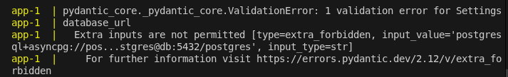
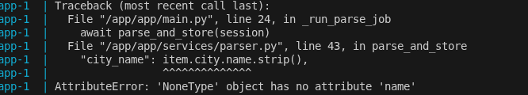
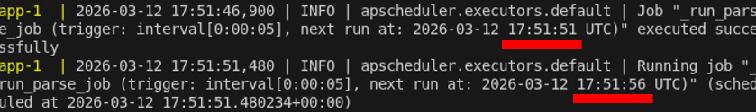
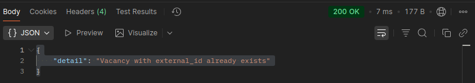
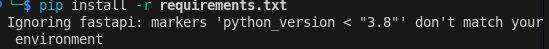

## 1. Первый запуск приложения — контейнер завершился с ошибкой

Traceback показал:

<div align="center">
<br>
</div>

**Причина:**  
Опечатка в `validation_alias` в файле `config.py`.

**Решение:**

**До:**
```python
validation_alias="DATABSE_URL",
```

**После:**
```python
validation_alias="DATABASE_URL",
```

---

## 2. Повторный запуск приложения — контейнер завершился ошибкой

Traceback показал:

<div align="center">
<br>
</div>

**Причина:**  
Код ожидал, что поле `city` всегда заполнено, но на самом деле это не так.

**Решение:**  
Добавили проверку наличия значения перед обращением к атрибуту `name`.  
Код проверяет, есть ли объект `city`, если его нет — присваивает ключу `city_name` значение `None`.

**До:**
```python
"city_name": item.city.name.strip(),
```

**После:**
```python
"city_name": (item.city.name or "").strip() if item.city else None,
```

---

## 3. Фоновый парсинг вакансий запускается каждые 5 секунд вместо 5 минут

При наблюдении за логами обнаружено, что фоновый парсинг вакансий запускается каждые **5 секунд** вместо запланированных **5 минут**.

<div align="center">
<br>
</div>

**Причина:**  
Переменная `settings.parse_schedule_minutes` использовалась как значение параметра `seconds=`, хотя по смыслу названия и документации она должна интерпретироваться как **минуты**.

**Решение:**

**До:**
```python
seconds=settings.parse_schedule_minutes,
```

**После:**
```python
minutes=settings.parse_schedule_minutes,
```

---

## 4. При создании вакансии с существующим `external_id` API возвращал `200 OK`

При попытке создать вакансию с уже существующим `external_id` API возвращал статус `200 OK` с сообщением об ошибке.

<div align="center">
<br>
</div>

**Причина:**  
В эндпоинте при обнаружении существующей вакансии возвращался `JSONResponse` со статусом `200 OK`.

**Решение:**

**До:**
```python
return JSONResponse(
    status_code=status.HTTP_200_OK,
    content={"detail": "Vacancy with external_id already exists"},
)
```

**После:**
```python
return JSONResponse(
    status_code=status.HTTP_409_CONFLICT,
    content={"detail": "Vacancy with external_id already exists"},
)
```

---

## 5. Ошибка скачивания FastAPI при установке зависимостей

При попытке установить зависимости возникла ошибка скачивания `FastAPI`.

<div align="center">
<br>
</div>

**Причина:**  
Указана **несуществующая версия FastAPI**.

**Решение:**  
Удалить строку:

```python
fastapi==999.0.0; python_version < "3.8"
```

---

## 6. Вакансия не удалялась из базы данных

При попытке удалить вакансию и снова обратиться к ней по `id` в ответ получалось, что запись **всё равно существует**.

**Причина:**  
В функции `delete_vacancy` метод `session.delete(vacancy)` вызывался без `await`, хотя используется асинхронная сессия `AsyncSession`.

Из-за этого:

- удаление не регистрировалось в **unit-of-work** сессии  
- запрос `DELETE` в базу не отправлялся  
- `await session.commit()` ничего не делал  

В результате эндпоинт возвращал **`204 No Content`**, но вакансия оставалась в базе (**ложный успех**).

**Решение:**

**До:**
```python
session.delete(vacancy)
await session.commit()
```

**После:**
```python
await session.delete(vacancy)
await session.commit()
```

---

## 7. Неконсистентный тип данных для `existing_ids` в `upsert_external_vacancies`

**Причина:**  
Переменная `existing_ids`:

- в случае наличия `external_id` получала тип **set**
- в случае пустого списка — тип **dict**

Формально всё работало, но это снижало **читаемость кода** и могло привести к проблемам при расширении логики.

**Решение:**

**До:**
```python
existing_ids = set(existing_result.scalars().all())
else:
    existing_ids = {}
```

**После:**
```python
existing_ids = set(existing_result.scalars().all())
else:
    existing_ids = set()
```

---

## 8. Утечка ресурсов из-за незакрытого `httpx.AsyncClient`

**Причина:**  
В функции `parse_and_store` создавался экземпляр `httpx.AsyncClient`, но нигде не вызывался `await client.aclose()`.

Из-за этого:

- пул соединений оставался открытым
- внутренние ресурсы клиента не освобождались
- возникала **утечка ресурсов** после завершения парсинга или ошибок

**Решение:**

**До:**
```python
client = httpx.AsyncClient(timeout=timeout)
```

**После:**
```python
async with httpx.AsyncClient(timeout=timeout) as client:
```
